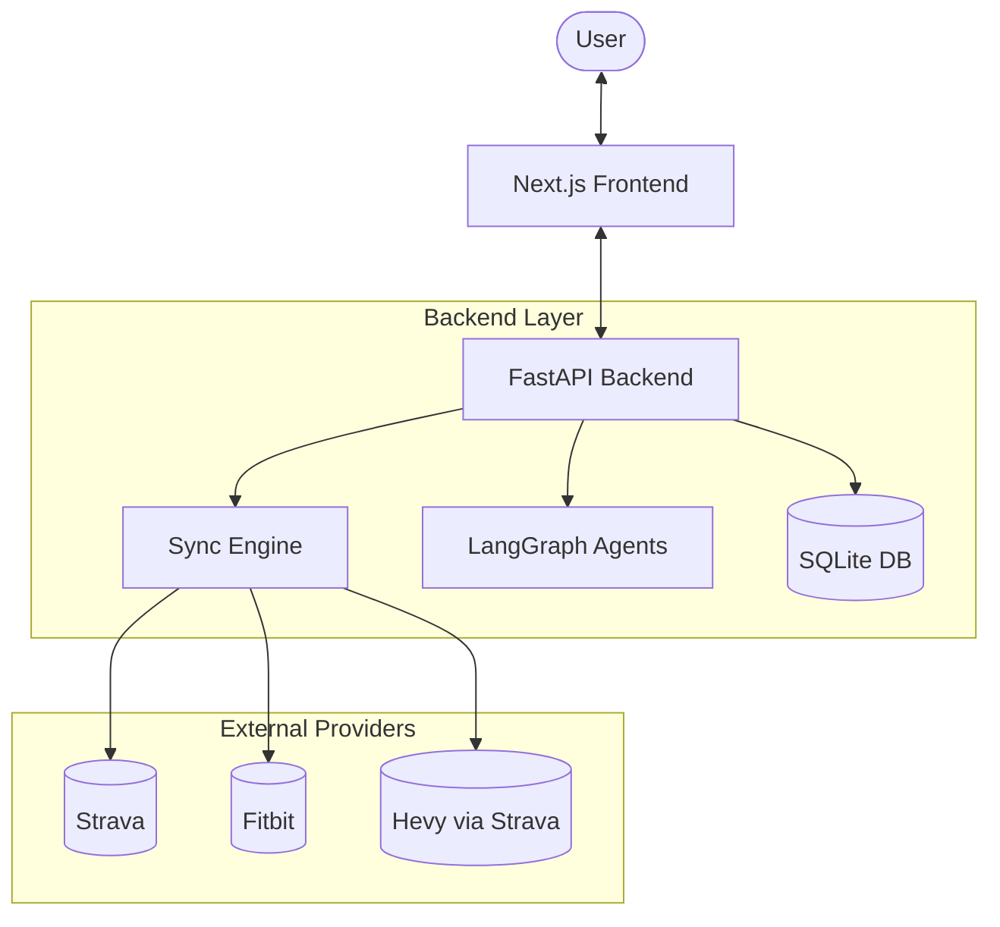

# System Architecture — Fitness Bridge AI

Fitness Bridge AI is a **multiagent system** designed to provide personalised fitness coaching by integrating data from multiple sources (Strava, Fitbit, Hevy).

## 1. High-Level Design

The system follows a decoupled architecture:
- **Backend**: FastAPI server (`main.py`) handling data ingestion, analysis, and agent orchestration.
- **Frontend**: Next.js SPA (`frontend/`) for the user dashboard and interaction.
- **Core**: Pure Python modules for analysis, parsing, and sync logic.

## 2. Guiding Principles

| Principle | Implication |
|---|---|
| **Algorithms over LLM** | LLMs handle narration and intent; specialized Python algorithms handle math and scoring. |
| **Aggressive Caching** | External API calls are cached on disk for 1 hour to ensure responsive UI and stay within rate limits. |
| **Modular Specialists** | Each agent in the graph has a single, focused responsibility (Readiness vs. Progress vs. General). |
| **Local-First** | Primary data storage is a local SQLite database, ensuring privacy and speed. |

## 3. Data Flow

1. **Ingestion**: The Sync Engine polls Strava and Fitbit APIs. 
2. **Parsing**: Strava activity descriptions are parsed (Hevy format) into structured sets/reps.
3. **Storage**: Normalised workout data is stored in SQLite with dual keys `(source, activity_id)`.
4. **Analysis**: On request, readiness scores, ACWR, and strength trends are computed from the database.
5. **Orchestration**: User queries are routed by a LangGraph router to the most qualified specialist agent.

## 4. Memory System

The system uses a three-tier memory architecture:
1. **Short-Term**: Recent messages in the current session (verbatim).
2. **Long-Term**: Summaries of old messages to preserve context without bloating tokens.
3. **Semantic**: Extracted facts (e.g., "User prefers evening workouts") stored as key-value pairs.

## 5. Agent Layer

Built with LangGraph, the agentic core consists of:
- **Router Node**: Classifies user intent (Heuristic/LLM fallback).
- **Specialists**:
    - **Readiness Specialist**: Focused on sleep, HRV, and recovery.
    - **Progress Analyst**: Focused on training volume, PRs, and muscle balance.
    - **Coach**: The general synthesiser that provides high-level guidance.
